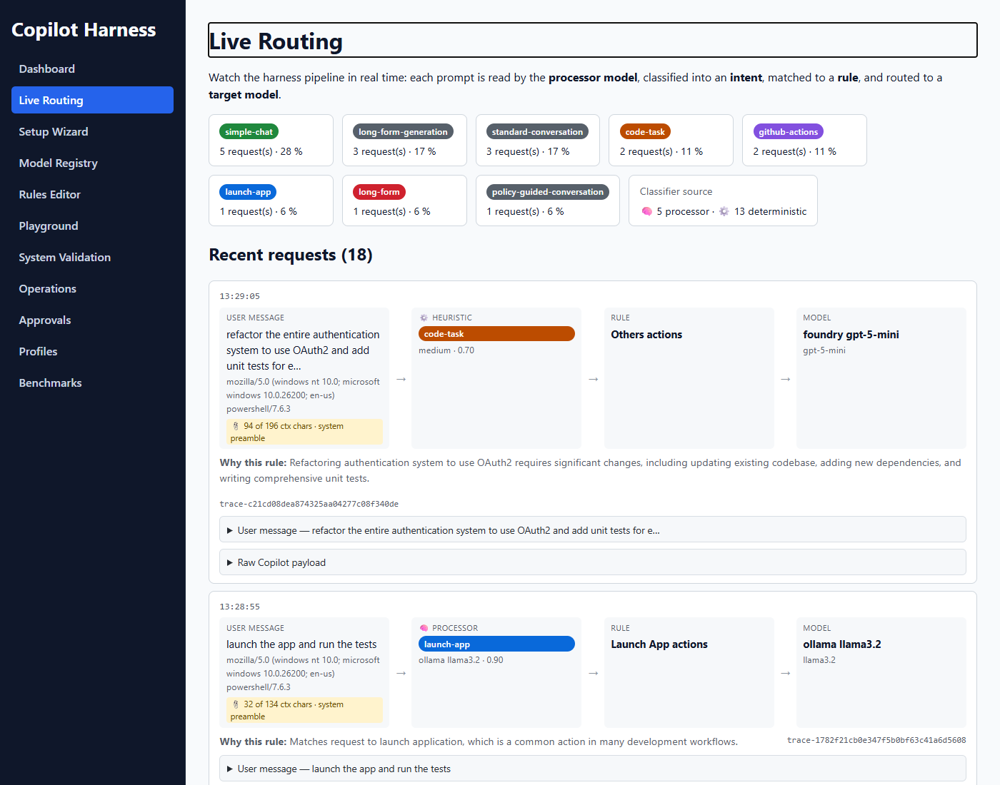
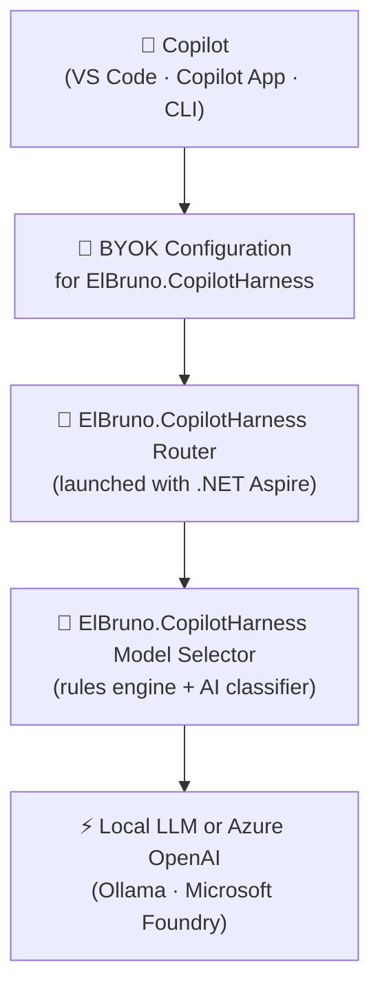

# ElBruno.CopilotHarness

[](https://dotnet.microsoft.com/download/dotnet/10.0)
[](https://aspire.dev)
[](LICENSE)
[]()
[]()
[](https://elbruno.github.io/ElBruno.CopilotHarness/)

> **Intelligent BYOK harness for GitHub Copilot** — built with .NET 10, .NET Aspire, and Microsoft Agent Framework.

Route every GitHub Copilot request through your own infrastructure. Choose which model handles each request, inspect every decision, benchmark quality over time, and enforce rules — all without touching your IDE.



🌐 **[Live site & animated walkthrough →](https://elbruno.github.io/ElBruno.CopilotHarness/)**

📸 More screenshots: [docs/screenshots.md](docs/screenshots.md)

---

## How it works

The harness sits between Copilot and the upstream model — a vertical stack where each layer feeds into the next.



▶️ Animated walkthrough: [docs/presentation/harness-layers.html](docs/presentation/harness-layers.html)

---

## What it does

| Feature | Description |
|---|---|
| **OpenAI-compatible router** | Drop-in proxy for GitHub Copilot BYOK — no client-side changes needed |
| **Multi-provider model registry** | Register any number of LLM connections — Ollama and Azure OpenAI/Foundry — with API keys encrypted at rest |
| **Condition-based routing rules** | Map prompt size, streaming, system message, keyword, or regex conditions to a target model, with a first-run wizard and a built-in rule tester |
| **Admin dashboard** | Manage models, rules, routing history, and approval workflows |
| **AI Judge** | Replay prompts, benchmark models, score quality with an AI evaluator |
| **Continuous evaluation** | Shadow routing, rule confidence scoring, human approval before changes apply |
| **VS Code extension** | Explain routing decisions and open the dashboard from inside VS Code |
| **OpenTelemetry** | Full distributed tracing across all services via the Aspire dashboard |

---

---

## Processor Model — pluggable local AI classifier

Before routing a request to a cloud model, the harness runs the prompt through a **processor model**
— a local AI that classifies the intent and picks the best routing rule. Any model in the registry
can be the processor; just set `IsProcessor = true` on it in the Admin UI.

| Option | Provider | Default endpoint | Install |
|---|---|---|---|
| **phi-4-mini** *(default)* | [Foundry Local](https://learn.microsoft.com/azure/foundry-local) | `http://localhost:5101` | `winget install Microsoft.FoundryLocal` |
| **llama3.1:8b** | [Ollama](https://ollama.com) | `http://localhost:11434` | `winget install Ollama.Ollama` |
| **gpt-5-mini** | Azure OpenAI | cloud | Azure portal |

> **No local model required.** If no processor is running the harness falls back to fast built-in
> keyword heuristics — routing still works, just without AI-based intent classification.

See [Processor Model Setup guide →](docs/Processor_Model_Setup.md)

---

## Fast start

### Prerequisites

- [.NET 10 SDK](https://dotnet.microsoft.com/download/dotnet/10.0)
- [Aspire CLI](https://aspire.dev) — `dotnet tool install --global aspire`
- A GitHub Copilot subscription
- An Microsoft Foundry endpoint + API key (for upstream model calls)

### 1 — Save your secrets (one-time setup)

Run these commands **once** before the first `aspire run`.  
Aspire saves them locally — you will never be prompted again.

```powershell
cd src/harness/ElBruno.CopilotHarness.AppHost

aspire secret set FoundryEndpoint "https://<your-resource>.openai.azure.com/openai/v1"
aspire secret set FoundryApiKey   "<your-azure-foundry-api-key>"
aspire secret set AdminApiKey     "<any-password-you-choose>"
```

| Parameter | What it is |
|---|---|
| `FoundryEndpoint` | Your Microsoft Foundry base URL (from the Azure portal, ends in `/openai/v1`) |
| `FoundryApiKey` | Your Microsoft Foundry API key |
| `AdminApiKey` | A password **you create** — protects the admin API. Any string works (e.g. `my-local-admin-key`) |

> **Tip:** `AdminApiKey` is not an external service key — it is a secret you invent to secure the harness admin endpoints. Set it to anything memorable.

### 2 — Run the system

```powershell
aspire run
```

<a id="3--set-up-byok-in-github-copilot"></a>
### 3 — Set up BYOK in GitHub Copilot (VS Code)

> **Quickest path — let the harness generate the config for you:**
> - Open **`http://localhost:5117/connect`** (the Router.Api self-service page) and click **Copy config**, or
> - Open the Admin dashboard **Setup Wizard → Connect to VS Code (BYOK)** panel, confirm the Router URL, and click **Copy config**.
>
> Both produce the exact `chatLanguageModels.json` shown below, with the chat URL already filled in. Then jump to step 5.

1. Start the harness with `aspire run` and copy the **Router.Api** URL from the Aspire dashboard (for example `http://localhost:5117`).
2. In VS Code, open **Copilot Chat** and then open the model picker at the bottom of chat.
3. Select **Manage Models** (or run **Chat: Manage Language Models** from the Command Palette).
4. Select **Add Models** and choose **Custom Endpoint**.
5. Configure the model to call your harness endpoint:
   - API type: **Chat Completions**
   - URL: `<Router.Api URL>/v1/chat/completions` (for example `http://localhost:5117/v1/chat/completions`)
   - Model id/name: any label you like (for example `elbruno.copilotharness`) — the router selects the real model from your routing rules.
   - API key: VS Code asks for one on first use; any non-empty value works unless you set an admin key.
6. Save the model configuration, pick this model in Copilot Chat, and send a prompt.

> **Notes**
> - If your organization manages Copilot policies, make sure **Bring Your Own Language Model Key in VS Code** is enabled.
> - The previous **GitHub Copilot: Advanced → Custom endpoint** settings flow is obsolete.
> - If **Custom Endpoint** is not listed, update VS Code (or use VS Code Insiders), then reopen **Manage Language Models**.
> - Official docs:
>   - https://code.visualstudio.com/docs/agent-customization/language-models#_add-a-custom-endpoint-model
>   - https://docs.github.com/en/copilot/how-tos/use-ai-models/change-the-chat-model#adding-more-models

If VS Code opens `chatLanguageModels.json`, this working example matches the harness:

```json
[
  {
    "name": "SmartRouter",
    "vendor": "customendpoint",
    "apiKey": "${input:chat.lm.secret.-32311979}",
    "apiType": "chat-completions",
    "models": [
      {
        "id": "elbruno.copilotharness",
        "name": "elbruno.copilotharness",
        "url": "http://localhost:5117/v1/chat/completions",
        "toolCalling": true,
        "vision": true,
        "maxInputTokens": 128000,
        "maxOutputTokens": 16000
      }
    ]
  }
]
```

---

## Option 2 — Smart Agents with local models

The **agents pattern** is a second way to use this repo. Instead of routing every prompt through the harness proxy, you use VS Code Copilot's multi-agent feature: `@harness-general` is a cloud-model orchestrator that delegates routine tasks — start/stop an app, open a GitHub PR, analyse a stack trace — to local sub-agents running on **phi-4-mini**. Routine work costs zero cloud credits.

### Agent roles

| Agent | Selectable | Model | Purpose |
|---|---|---|---|
| `@harness-general` | ✅ You call this | Copilot default (cloud) | Orchestrator — routes tasks, answers architecture questions |
| `@harness-launch` | ❌ Sub-agent | phi-4-mini (local) | Start/stop apps, resolve port conflicts |
| `@harness-github` | ❌ Sub-agent | phi-4-mini (local) | Issues, PRs, GitHub Actions, releases |
| `@harness-debug` | ❌ Sub-agent | phi-4-mini (local) | Error analysis, stack traces, test failures |
| `@harness-db` | ❌ Sub-agent | phi-4-mini (local) | SQL queries, EF Core migrations, schema inspection |
| `@harness-test` | ❌ Sub-agent | phi-4-mini (local) | xUnit/NUnit/Pytest scaffolding, coverage gaps, test failure analysis |
| `@harness-docs` | ❌ Sub-agent | phi-4-mini (local) | XML docstrings, CHANGELOG entries, README section updates |
| `@harness-deploy` | ❌ Sub-agent | phi-4-mini (local) | Dockerfile, docker-compose, GitHub Actions, Bicep stubs |

### Cost comparison

| Request type | Cloud-only | With agents |
|---|---|---|
| "run the API" | ~500 tokens | 0 (local) |
| "open a PR" | ~800 tokens | 0 (local) |
| "debug this error" | ~1 200 tokens | 0 (local) |
| Typical 10-task session | ~8 000 tokens | ~1 500 cloud + 0 local |

### Quick start (3 steps)

```powershell
# Step 1 — Install agent templates and VS Code config (skip if you're already in this repo)
harness init   # copies .github/agents/ into your repo AND auto-writes chatLanguageModels.json
               # to your VS Code user config folder — no manual file placement needed

# Step 2 — Start FoundryLocalProxy (serves phi-4-mini locally)
cd src/proxies/FoundryLocalProxy && dotnet run
# Easiest alternative: aspire start from src/proxies/
cd proxies && aspire start

# Step 3 — Validate the full setup
harness doctor
```

### Usage examples

```
@harness-general start the web API
@harness-general open a PR for the current branch
@harness-general why is AuthController throwing a NullReferenceException?
@harness-general review the architecture of the Router service
```

Run `harness doctor` to validate the full setup (Aspire CLI, proxy health, agent files, VS Code config).

📖 Full details: [docs/Agents_Architecture.md](docs/Agents_Architecture.md)

---

## Documentation

| Doc | Description |
|---|---|
| [User Manual](docs/User_Manual.md) | Full setup and feature walkthrough |
| [Model Registry](docs/Model_Registry.md) | Multi-provider model connections and API-key encryption |
| [Processor Model Setup](docs/Processor_Model_Setup.md) | Configure Foundry Local, Ollama, or Azure as the routing classifier |
| [Migration: Ollama → Foundry Local](docs/Migration_Ollama_To_FoundryLocal.md) | Switch the processor model without breaking existing setups |
| [Rules Engine](docs/Rules_Engine.md) | Condition-based routing rules, wizard, and rule testing |
| [Live Routing](docs/Live_Routing.md) | Visual prompt → model → rule → explanation feed (dashboard + VS Code) |
| [Architecture](docs/Architecture.md) | System design and component boundaries |
| [API Reference](docs/API_Reference.md) | All router and admin endpoints |
| [Current Progress](docs/Current_Progress.md) | Phase status and what's implemented |
| [Troubleshooting](docs/Troubleshooting.md) | Common issues and fixes |
| [Runbook](docs/Runbook.md) | Start, stop, reset, and inspect |
| [Contributing](docs/Contributing.md) | Local dev setup and PR expectations |
| [Docs Index](docs/Docs_Index.md) | Full docs index |

---

## Validate

```powershell
dotnet test .\ElBruno.CopilotHarness.slnx
```

---

## 👋 About the author

Hi! I'm **ElBruno** 🧡, a passionate developer and content creator exploring AI, .NET, and modern development practices.

**Made with ❤️ by [ElBruno](https://github.com/elbruno)**

If you like this project, consider following my work across platforms:

- 📻 **Podcast**: [No Tienen Nombre](https://notienenombre.com) — Spanish-language episodes on AI, development, and tech culture
- 💻 **Blog**: [ElBruno.com](https://elbruno.com) — Deep dives on embeddings, RAG, .NET, and local AI
- 📺 **YouTube**: [youtube.com/elbruno](https://www.youtube.com/elbruno) — Demos, tutorials, and live coding
- 🔗 **LinkedIn**: [@elbruno](https://www.linkedin.com/in/elbruno/) — Professional updates and insights
- 𝕏 **Twitter**: [@elbruno](https://www.x.com/elbruno) — Quick tips, releases, and tech news
