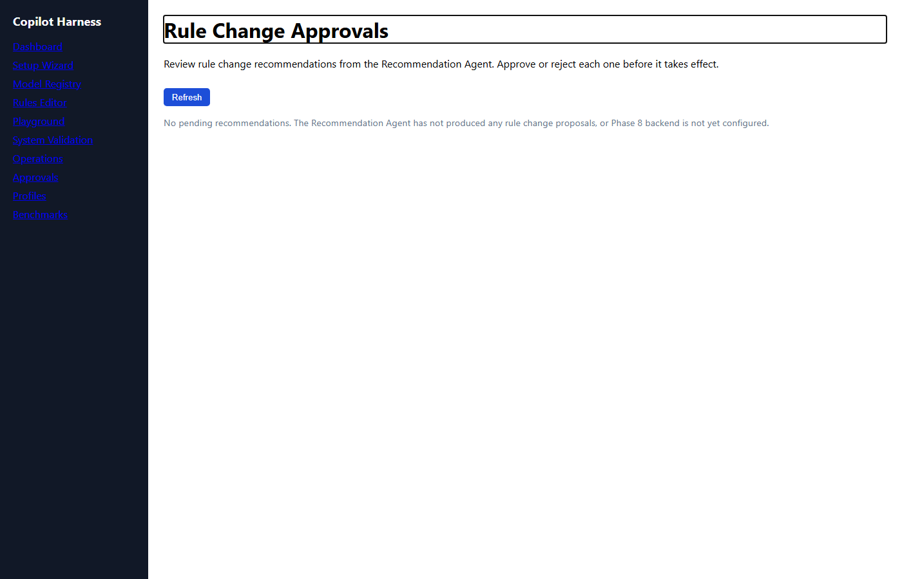

# ElBruno.CopilotHarness

> **Intelligent BYOK harness for GitHub Copilot** — built with .NET 10, .NET Aspire, and Microsoft Agent Framework.

Route every GitHub Copilot request through your own infrastructure. Choose which model handles each request, inspect every decision, benchmark quality over time, and enforce rules — all without touching your IDE.

---

## What it does

| Feature | Description |
|---|---|
| **OpenAI-compatible router** | Drop-in proxy for GitHub Copilot BYOK — no client-side changes needed |
| **Intelligent model routing** | Rules + AI agents select the best model per request |
| **Admin dashboard** | Manage models, rules, routing history, and approval workflows |
| **AI Judge** | Replay prompts, benchmark models, score quality with an AI evaluator |
| **Continuous evaluation** | Shadow routing, rule confidence scoring, human approval before changes apply |
| **VS Code extension** | Explain routing decisions and open the dashboard from inside VS Code |
| **OpenTelemetry** | Full distributed tracing across all services via the Aspire dashboard |

---

## Screenshots

### Aspire Dashboard


### Admin — Live Routing Dashboard


### Admin — Rules Editor


### Admin — Approval Workflow (Phase 8)


### Judge — Benchmark Results


---

## Fast start

### Prerequisites

- [.NET 10 SDK](https://dotnet.microsoft.com/download/dotnet/10.0)
- [Aspire CLI](https://aspire.dev) — `dotnet tool install --global aspire`
- A GitHub Copilot subscription
- An Azure AI Foundry endpoint + API key (for upstream model calls)

### 1 — Run the system

```powershell
aspire run
```

### 2 — Configure secrets

When prompted by Aspire, provide:

| Parameter | Description |
|---|---|
| `FoundryEndpoint` | Your Azure AI Foundry base URL |
| `FoundryApiKey` | Your Azure AI Foundry API key |
| `AdminApiKey` | Optional bearer token for admin endpoints |

### 3 — Set up BYOK in GitHub Copilot

1. Open the Aspire dashboard and copy the **Router.Api** URL (e.g. `https://localhost:7xxx`).
2. In VS Code, open Settings → **GitHub Copilot** → **Advanced** → **Custom endpoint**.
3. Set the endpoint to `https://localhost:7xxx/v1` and leave the model as `gpt-5-mini`.
4. Copilot requests will now route through your harness.

---

## Documentation

| Doc | Description |
|---|---|
| [User Manual](docs/User_Manual.md) | Full setup and feature walkthrough |
| [Architecture](docs/Architecture.md) | System design and component boundaries |
| [API Reference](docs/API_Reference.md) | All router and admin endpoints |
| [Current Progress](docs/Current_Progress.md) | Phase status and what's implemented |
| [Troubleshooting](docs/Troubleshooting.md) | Common issues and fixes |
| [Runbook](docs/Runbook.md) | Start, stop, reset, and inspect |
| [Contributing](docs/Contributing.md) | Local dev setup and PR expectations |
| [Docs Index](docs/Docs_Index.md) | Full docs index |

---

## Validate

```powershell
dotnet test .\ElBruno.CopilotHarness.slnx
```
