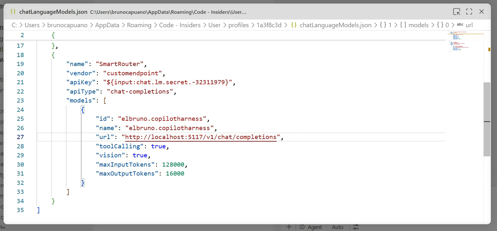

# User Manual

## What this app does

ElBruno.CopilotHarness is a BYOK harness for GitHub Copilot with:

- OpenAI-compatible router endpoints
- Aspire-based local orchestration
- Admin UI for routing, models, rules, and validation
- Multi-client telemetry for VS Code, Copilot CLI, and Copilot App
- Judge app for prompt replay, multi-model benchmarks, and evaluation reports
- VS Code extension for routing explanations and dashboard links

## Install and run

### Prerequisites

- .NET 10 SDK
- Aspire CLI (`aspire`)

### Configure Aspire parameters (one-time)

Run these commands **once** inside the AppHost project folder before the first `aspire run`.
Aspire saves them locally so you are never prompted again.

```powershell
cd src/ElBruno.CopilotHarness.AppHost

aspire secret set FoundryEndpoint "https://<your-resource>.openai.azure.com/openai/v1"
aspire secret set FoundryApiKey   "<your-azure-foundry-api-key>"
aspire secret set AdminApiKey     "<any-password-you-choose>"
```

| Parameter | What it is |
|---|---|
| `FoundryEndpoint` | Azure AI Foundry base URL (ends in `/openai/v1`) |
| `FoundryApiKey` | Azure AI Foundry API key |
| `AdminApiKey` | A password **you invent** — protects the admin endpoints. Any string works. |

### Start

```powershell
aspire run
```

### Configure BYOK in VS Code (current flow)

The old **GitHub Copilot: Advanced → Custom endpoint** path is no longer the supported VS Code UX.
Use the model manager flow instead:

> **Tip — generate the config automatically.** Open **`http://localhost:5117/connect`** (the Router.Api
> self-service page) or the Admin dashboard **Setup Wizard → Connect to VS Code (BYOK)** panel and click
> **Copy config**. Both produce the exact `chatLanguageModels.json` below with the URL pre-filled.

1. Open **Copilot Chat** in VS Code.
2. In the chat input area, open the model picker.
3. Click **Manage Models** (or run **Chat: Manage Language Models** from the Command Palette).
4. Click **Add Models** and choose **Custom Endpoint**.
5. Configure the endpoint with your running harness:
   - API type: **Chat Completions**
   - URL: `<Router.Api URL>/v1/chat/completions` (for example `http://localhost:5117/v1/chat/completions`)
   - Model id: any label you like (for example `elbruno.copilotharness`) — the router picks the real model from your rules.
6. Save and select that model in the chat model picker.

If you're using Copilot Business or Enterprise, ensure your org policy enables:
**Bring Your Own Language Model Key in VS Code**.

If **Custom Endpoint** does not appear in the provider list, update VS Code (or use VS Code Insiders) and reopen **Manage Language Models**.

If VS Code opens `chatLanguageModels.json`, use this working harness example:

```json
[
  {
    "name": "SmartRouter",
    "vendor": "customendpoint",
    "apiKey": "${input:chat.lm.secret.-32311979}",
    "apiType": "chat-completions",
    "models": [
      {
        "id": "elbruno.copilotharness",
        "name": "elbruno.copilotharness",
        "url": "http://localhost:5117/v1/chat/completions",
        "toolCalling": true,
        "vision": true,
        "maxInputTokens": 128000,
        "maxOutputTokens": 16000
      }
    ]
  }
]
```



Official references:
- https://code.visualstudio.com/docs/agent-customization/language-models#_add-a-custom-endpoint-model
- https://docs.github.com/en/copilot/how-tos/use-ai-models/change-the-chat-model#adding-more-models

## VS Code extension

1. Open `src/ElBruno.CopilotHarness.VSCode` in VS Code.
2. Run `npm install`.
3. Press `F5`.

### Commands

- `Harness: Show Status Panel`
- `Harness: Explain Routing`
- `Harness: Open Dashboard`
- `Harness: Open Trace`

### Chat

Use `@harness` in Copilot Chat to ask for routing explanations or dashboard links.

## Manage models and rules

The harness routes each request to a model you register, based on rules you control.

### Models (`/models`)

The Models page is your registry of LLM connections. Add as many as you need:

1. Click **Add model** and choose a **type**:
   - **Ollama** — set the server endpoint (e.g. `http://localhost:11434`) and the model
     name (e.g. `llama3.1:8b`). No API key needed.
   - **Azure OpenAI / Foundry** — set the endpoint, the **deployment name** (e.g.
     `gpt-5-mini`), API version, and the API key.
2. Save. API keys are encrypted at rest and never shown again — the page only indicates
   whether a key is set.
3. Use **Test connection** to verify the endpoint responds.
4. Pick the **default model** (used when no rule matches).

See [Model Registry](Model_Registry.md) for full details.

### Rules (`/rules`)

Rules map request conditions to a target model, evaluated in priority order:

1. If no rules exist, use **Generate starter rules** for a sensible first set.
2. Add or edit a rule: choose a **condition** (prompt size, streaming, system message,
   requested model, keyword, or regex), a **target model** from the registry, and a
   **priority** (lower runs first).
3. Use the **Test** panel to enter a prompt and see which rule matches and which model
   would be selected.

See [Rules Engine](Rules_Engine.md) for full details.

## Common URLs

- Router: `/v1/chat/completions`
- Router models: `/v1/models`
- Router responses: `/v1/responses`
- Health: `/health`
- Liveness: `/alive`
- Admin dashboard: `/`
- Setup wizard: `/setup`
- Models: `/models`
- Rules: `/rules`
- Playground: `/playground`
- Validation: `/validation`
- Judge app root: open `judge-web` from the Aspire dashboard
- Judge replay prompts: `/replay`
- Judge benchmarks: `/benchmarks`
- Judge reports: `/reports`
- Judge manual controls: `/manual`
- Judge manual benchmark: `/judge/benchmarks/manual`
- Judge reports: `/judge/benchmarks/runs` and `/judge/reports/{runId}`
- Phase 7 extension docs: `docs/Phase7_VSCode_Extension.md`

## What to look at first

1. Open `README.md` for the quickest overview.
2. Open `docs/Current_Progress.md` to see what phase is done.
3. Open `docs/Docs_Index.md` to find the rest of the docs.
