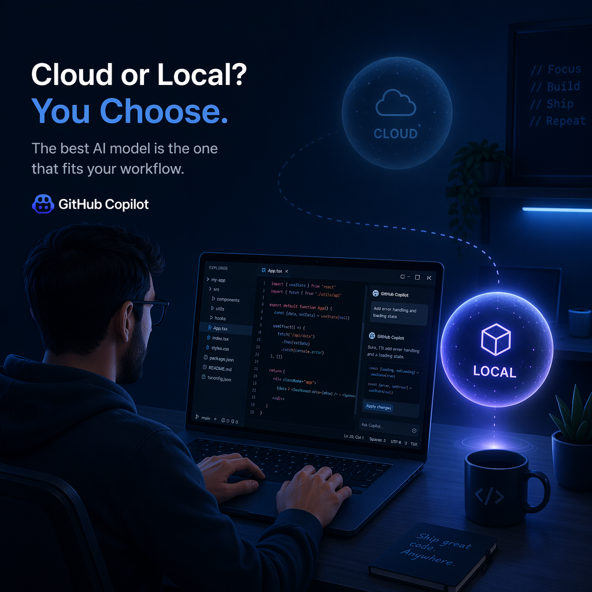
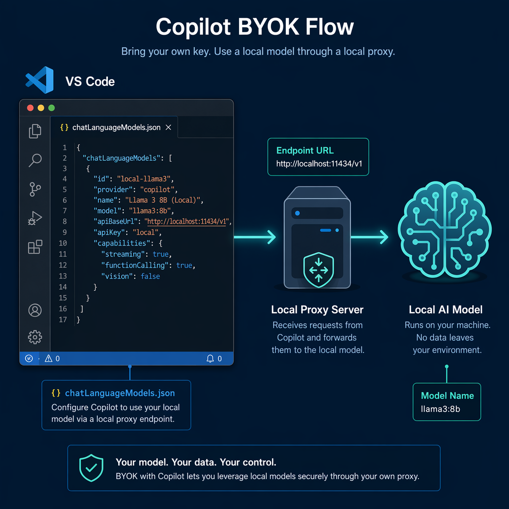
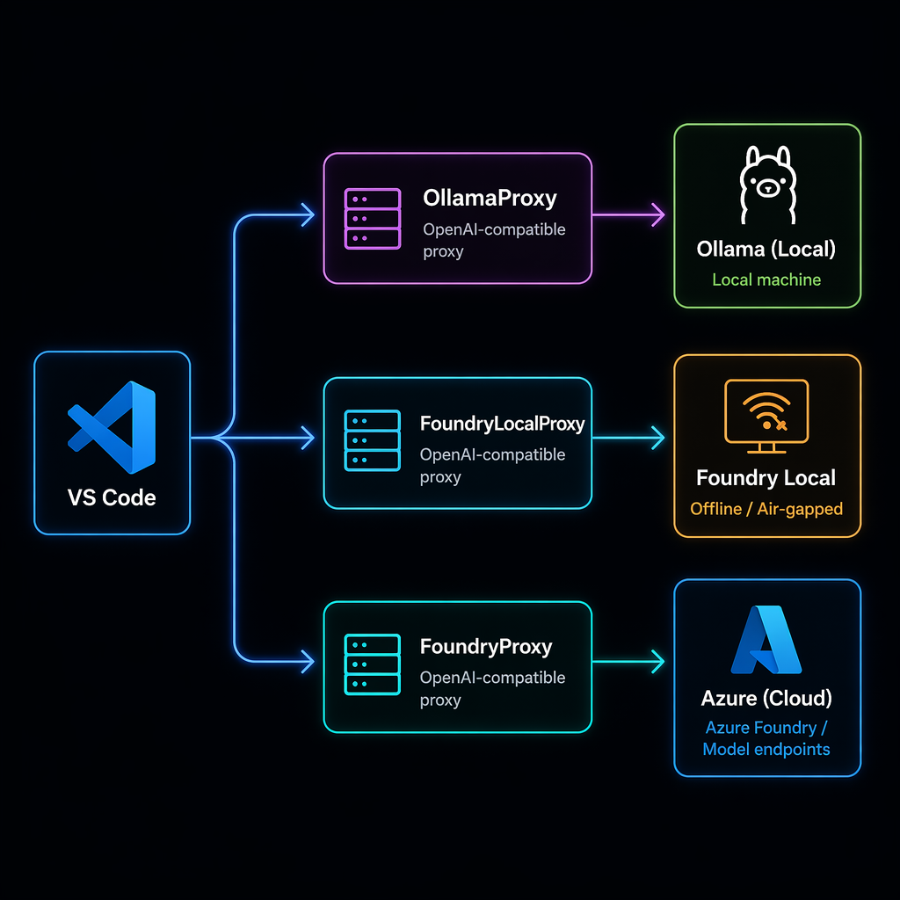
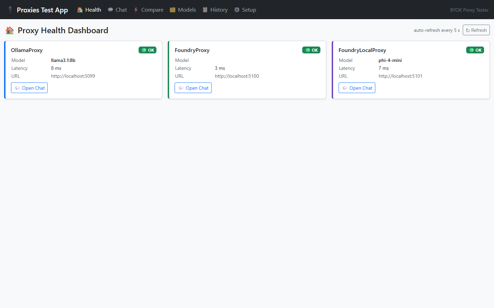
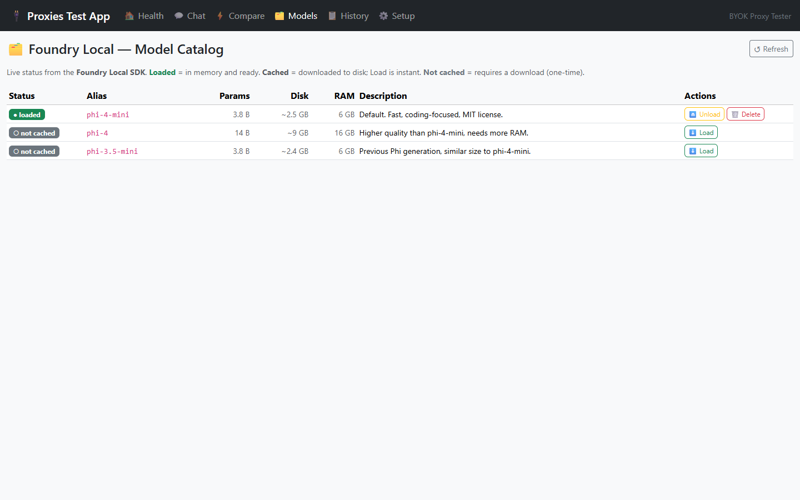
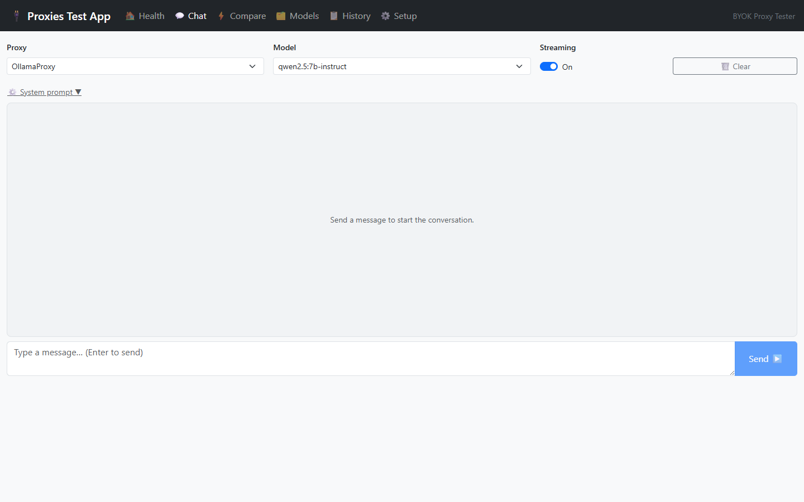
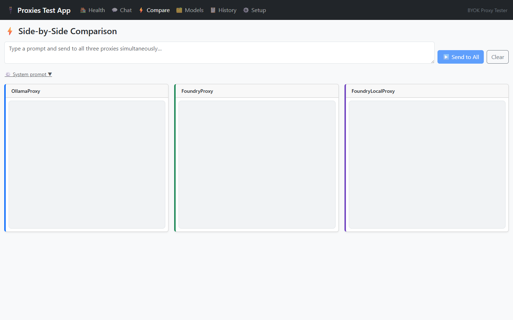
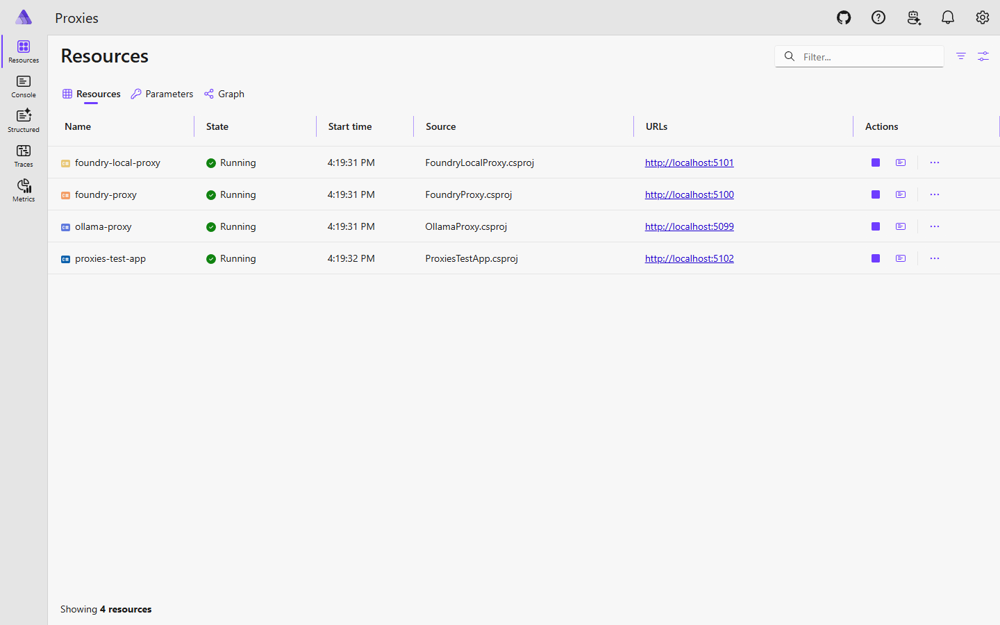
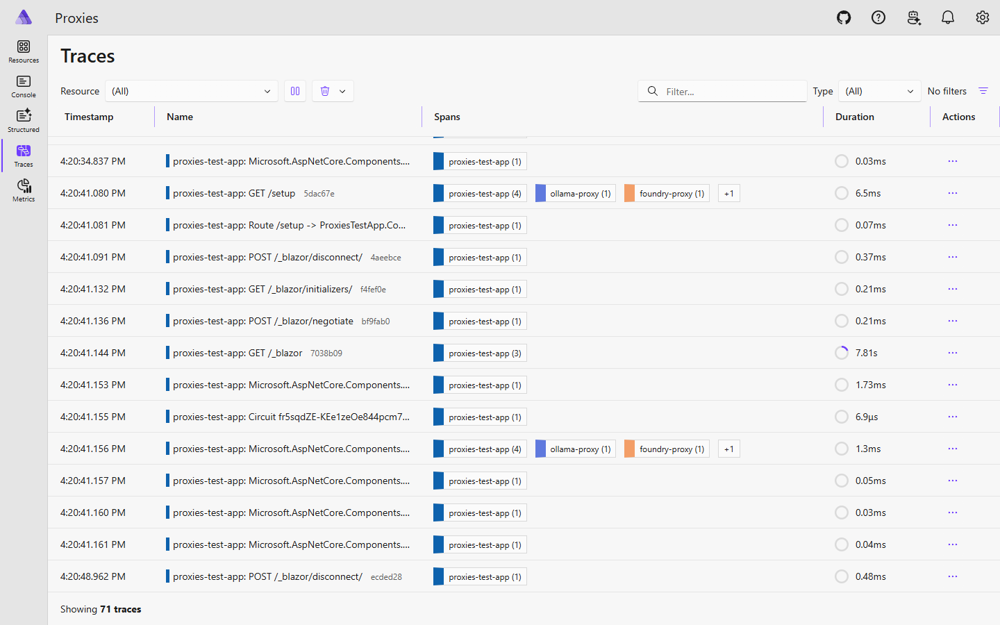
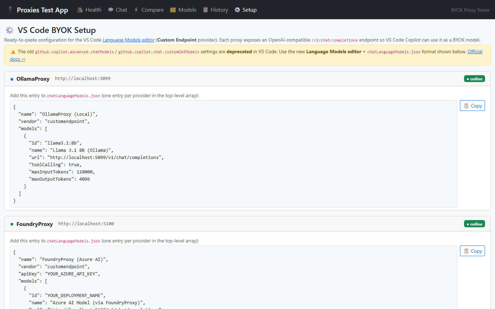

# Run the Right AI Model for the Right Copilot Task — No Cloud Credits Wasted

*Part 1 of the CopilotHarness series*

---



Big models are great for heavy thinking. But what about simple questions — "rename this variable", "write a short docstring", "what does this function do"? Those don't need GPT-5 across the internet. They can be answered instantly by a model running on your own machine, offline, for free.

This post shows you how to wire GitHub Copilot in VS Code to local models using three minimal proxies — one for Ollama, one for Foundry Local, one for Azure OpenAI — and how to run all three together with a single command.

---

## 1. How BYOK Works in VS Code

VS Code Copilot supports a **Bring Your Own Model** mechanism. You register any OpenAI-compatible endpoint in a config file, and Copilot treats it as just another model in the picker — no extension, no plugin.

**Official docs:** [Bring your own model to GitHub Copilot Chat](https://code.visualstudio.com/docs/copilot/language-models)

The config lives in a file called `chatLanguageModels.json` in your VS Code user folder:

```json
{
  "providers": [
    {
      "name": "Ollama (local)",
      "vendor": "customendpoint",
      "url": "http://localhost:5099/v1",
      "modelId": "llama3.1:8b",
      "chatModelId": "copilot-chat-model"
    }
  ]
}
```

That's it — point `url` at any OpenAI-compatible endpoint, give it a name, and it appears in Copilot's model picker.



---

## 2. The Three Proxy Flavors

A local model provider isn't always OpenAI-compatible out of the box. Each proxy in this repo acts as a thin translation layer — it speaks OpenAI on one side and the local backend on the other.



| Proxy | Port | Backend | Best for |
|---|---|---|---|
| **OllamaProxy** | 5099 | Ollama (local) | Quickest start, huge model catalog |
| **FoundryLocalProxy** | 5101 | Foundry Local SDK (offline, NPU) | Offline/air-gapped, hardware acceleration |
| **FoundryProxy** | 5100 | Azure OpenAI / Foundry cloud | Production-grade, secret-managed cloud models |

Each proxy is a **single ASP.NET Core Minimal API file** — no frameworks, no abstractions. The entire proxy fits on one screen. That's intentional: these are teaching samples, not production middleware.

---

## 3. The Shared Secret: Unwrapping Copilot's Envelope

Here's something most developers don't know: when GitHub Copilot Chat sends "hi", it doesn't send just `"hi"`. It sends this:

```xml
<attachments>...file contents...</attachments>
<context>...editor state...</context>
<reminderInstructions>...workspace instructions...</reminderInstructions>
<userRequest>hi</userRequest>
```

The actual message is buried inside `<userRequest>`. A proxy that naively reads the last user message sees **~3 KB of boilerplate** instead of the word "hi".

All three proxies share one class — `CopilotMessageExtractor` — that unwraps this envelope. It lives in the shared `Proxies.Common` library:

```csharp
// The key method — finds <userRequest>...</userRequest> and returns its content.
// Falls back gracefully for non-Copilot clients (curl, SDK) that send plain text.
public static string ExtractTypedUserMessage(string rawUserMessage)
{
    // Look for <userRequest> first (VS Code Copilot always uses this)
    var userRequest = ExtractTagContent(rawUserMessage, "userRequest")
                   ?? ExtractTagContent(rawUserMessage, "user-request");

    if (!string.IsNullOrWhiteSpace(userRequest))
        return userRequest.Trim();

    // No tag — strip all known wrapper blocks and return what's left
    var stripped = rawUserMessage;
    foreach (var tag in CopilotWrapperTags)
        stripped = RemoveTagBlock(stripped, tag);

    // If stripping removed everything, fall back to the raw message
    // (this path is hit for plain curl/SDK clients — they send plain text)
    return string.IsNullOrWhiteSpace(stripped.Trim())
        ? rawUserMessage.Trim()
        : stripped.Trim();
}
```

This class is why the proxies work correctly with both Copilot Chat and direct API calls. The logging in each proxy shows the *real* ask — not the 3 KB envelope.

---

## 4. OllamaProxy — 5 Minutes to Your First Local Model

**Pre-requisite:** [Ollama](https://ollama.com) running with at least one model pulled.

```bash
# Pull a model
ollama pull llama3.1:8b

# Start the proxy
cd src/proxies/OllamaProxy
dotnet run
# → http://localhost:5099
```

The proxy auto-discovers your installed Ollama models and passes the model ID through. Add it to VS Code:

```json
// chatLanguageModels.json  (Windows: %APPDATA%\Code\User\)
{
  "providers": [
    {
      "name": "Ollama — llama3.1:8b",
      "vendor": "customendpoint",
      "url": "http://localhost:5099/v1",
      "modelId": "llama3.1:8b",
      "chatModelId": "copilot-chat-model"
    }
  ]
}
```

Verify it's running:

```bash
curl http://localhost:5099/health
# → {"status":"ok","backend":"ollama","models":["llama3.1:8b",...]}
```



---

## 5. FoundryLocalProxy — Offline + NPU Inference

[Microsoft Foundry Local](https://github.com/microsoft/foundry-local) runs models fully offline using the ONNX Runtime with hardware acceleration (CPU, GPU, NPU on Windows).

**No pre-requisites** — the SDK downloads the model on first run and caches it locally.

```bash
cd src/proxies/FoundryLocalProxy
dotnet run
# First run: downloads phi-4-mini (~2.5 GB) automatically
# → http://localhost:5101
```

The **Models page** in the test app shows which models are cached, lets you load/unload (frees GPU RAM instantly), and delete models from disk:



> 💡 **Tip:** Use the Models page to download a model *before* chatting with it. If you send a chat request to an unloaded model, you get a clear error explaining the model needs to be loaded first — not a cryptic 500.

Add it to VS Code alongside Ollama — Copilot lets you pick which model to use per conversation:

```json
{
  "name": "Foundry Local — phi-4-mini",
  "vendor": "customendpoint",
  "url": "http://localhost:5101/v1",
  "modelId": "phi-4-mini",
  "chatModelId": "copilot-chat-model"
}
```

---

## 6. FoundryProxy — Azure OpenAI with Proper Secret Management

For cloud models, FoundryProxy uses [.NET User Secrets](https://learn.microsoft.com/en-us/aspnet/core/security/app-secrets) so your API key never touches the repo.

```bash
cd src/proxies/FoundryProxy

# Store credentials locally (never committed to git)
dotnet user-secrets set "Foundry:Endpoint"   "https://your-resource.openai.azure.com"
dotnet user-secrets set "Foundry:ApiKey"     "your-key"
dotnet user-secrets set "Foundry:Deployment" "gpt-4o-mini"

dotnet run
# → http://localhost:5100
```

---

## 7. All Three Together — One Command with Aspire

The fastest way to run everything is via the [.NET Aspire](https://learn.microsoft.com/en-us/dotnet/aspire/get-started/aspire-overview) CLI. One command starts all three proxies, the Blazor test app, and the Aspire dashboard with logs, traces, and health checks:

```bash
cd src/proxies
aspire start
```

What starts:

| Service | URL | What it is |
|---|---|---|
| `ollama-proxy` | http://localhost:5099 | OllamaProxy |
| `foundry-proxy` | http://localhost:5100 | FoundryProxy |
| `foundry-local-proxy` | http://localhost:5101 | FoundryLocalProxy |
| `proxies-test-app` | http://localhost:5102 | Blazor test UI |
| Aspire dashboard | printed in console | Logs, traces, health for all services |

> **Requires Aspire CLI:** `dotnet workload install aspire`

The Blazor **test app** at `http://localhost:5102` gives you a browser UI to test all three proxies without writing any code:



 traces for every request, including custom `LlmActivity` spans with prompt text, model ID, token counts, and latency. You can see exactly what Copilot sent and what the model returned.





To stop everything:

```bash
aspire stop
```

---

## 8. Wire It to VS Code Copilot

The `/setup` page at `http://localhost:5102/setup` generates the exact `chatLanguageModels.json` snippet for each running proxy, with the correct port and model ID. Copy and paste into your VS Code user config folder:



- **Windows:** `%APPDATA%\Code\User\chatLanguageModels.json`
- **macOS:** `~/Library/Application Support/Code/User/chatLanguageModels.json`
- **Linux:** `~/.config/Code/User/chatLanguageModels.json`

After saving, reload VS Code. Open Copilot Chat, click the model picker, and your local models appear alongside the built-in cloud models.

> 💡 **Shortcut:** If you have the [CopilotHarness CLI tool](../../src/tools/CopilotHarness.Tool/README.md) installed, running `harness init` writes this file automatically.

---

## 9. What's Next — Smart Routing

The proxies shown here are static: you pick a model manually per conversation. The next level is **automatic routing** — where every Copilot request is analyzed and sent to the best model automatically.

*"Is this a simple rename? → local llama3.1:8b. Is this a complex architecture question? → cloud GPT-5. Is this about GitHub Actions? → a specialist agent."*

That's what the full [CopilotHarness router](../../README.md) does — policy-based routing with semantic matching, local classifiers, and per-request telemetry. Part 2 of this series walks through building and using it.

**Repo:** [github.com/elbruno/ElBruno.CopilotHarness](https://github.com/elbruno/ElBruno.CopilotHarness)

---

## Quick Reference

| Goal | Command |
|---|---|
| Start just Ollama proxy | `cd src/proxies/OllamaProxy && dotnet run` |
| Start all three + test UI | `cd src/proxies && aspire start` |
| Stop all | `aspire stop` |
| Generate VS Code config | Open http://localhost:5102/setup |
| View traces | Open Aspire dashboard URL printed in console |
| Manage Foundry Local models | Open http://localhost:5102/models |
| Test proxy health | `curl http://localhost:5099/health` |

---

*This is Part 1 of the CopilotHarness series.*  
*Next: [Part 2 — Smart Routing: Sending Each Request to the Right Model Automatically]()*

*Code: [github.com/elbruno/ElBruno.CopilotHarness/tree/main/src/proxies](https://github.com/elbruno/ElBruno.CopilotHarness/tree/main/src/proxies)*
