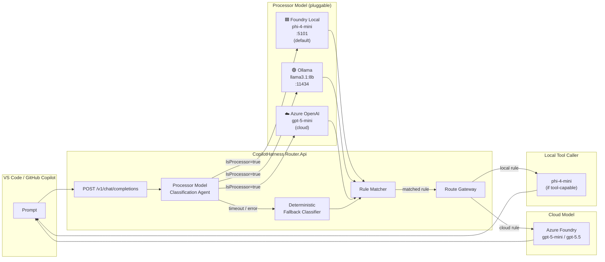

# Processor Model Architecture

## Routing pipeline with pluggable processor model



## Provider type comparison

| | Foundry Local | Ollama | Azure OpenAI |
|---|---|---|---|
| `type` value | `foundry-local` | `ollama` | `azure-openai` |
| Default port | 5101 (proxy) / 55588 (SDK) | 11434 | cloud |
| API key | ❌ None | ❌ None | ✅ Required |
| Default processor model | phi-4-mini | llama3.1:8b | gpt-5-mini |
| NPU-capable | ✅ Yes | ❌ No | N/A |
| Tool-calling | ✅ Yes (phi-4-mini) | ✅ Yes (llama3.1:8b) | ✅ Yes |
| Install | `winget install Microsoft.FoundryLocal` | `winget install Ollama.Ollama` | Azure portal |

## Configuration flexibility

Any model in the registry can become the processor by setting `IsProcessor = true`.
The router's classification path is fully provider-agnostic — the same code runs
regardless of whether the processor is Foundry Local, Ollama, or a cloud GPT.

```
Router.Api/Intelligence/
  ProcessorModelClassificationAgent  ← provider-agnostic orchestrator
    IChatCompletionsProviderFactory  ← picks the right HTTP client
      FoundryLocalChatCompletionsProvider  ← type: foundry-local
      OllamaChatCompletionsProvider        ← type: ollama
      AzureFoundryChatCompletionsProvider  ← type: azure-openai
    DeterministicClassificationAgent ← keyword fallback (no model needed)
```
