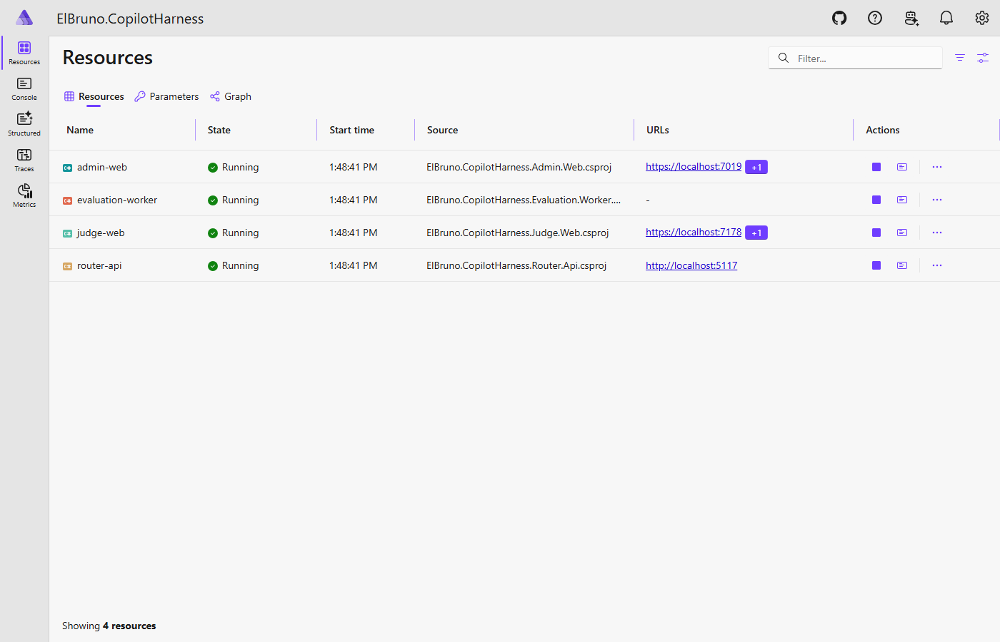
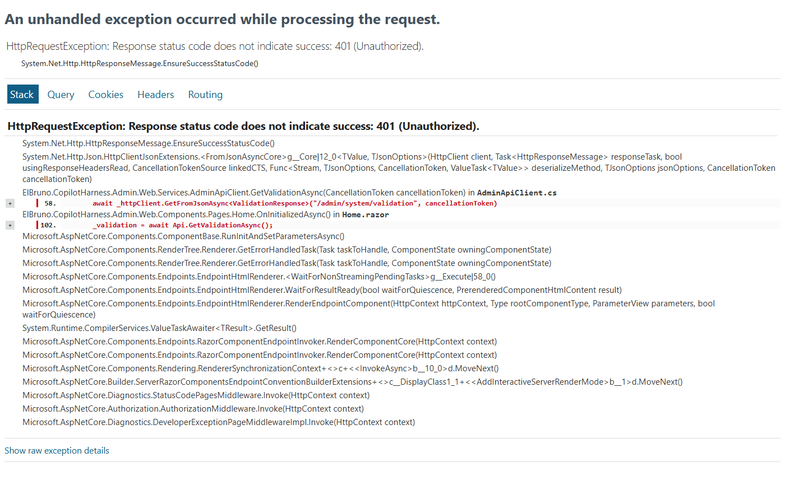
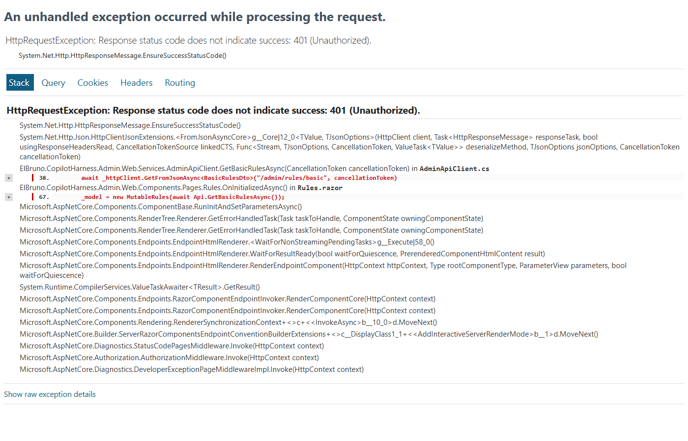
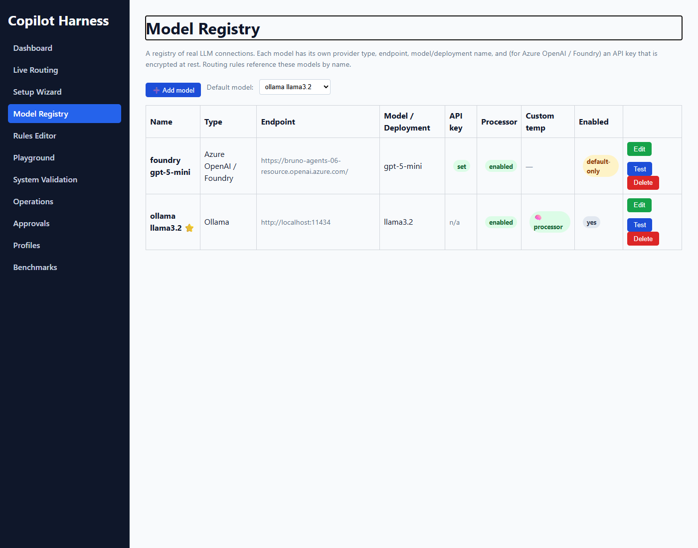
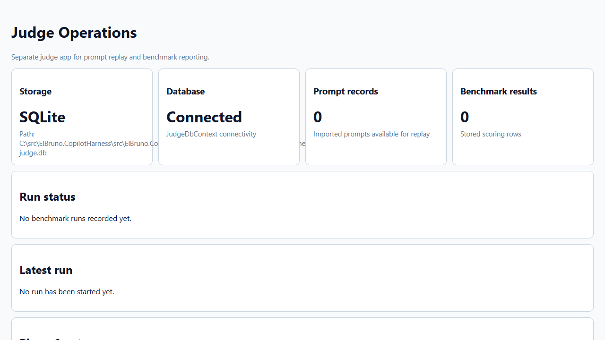
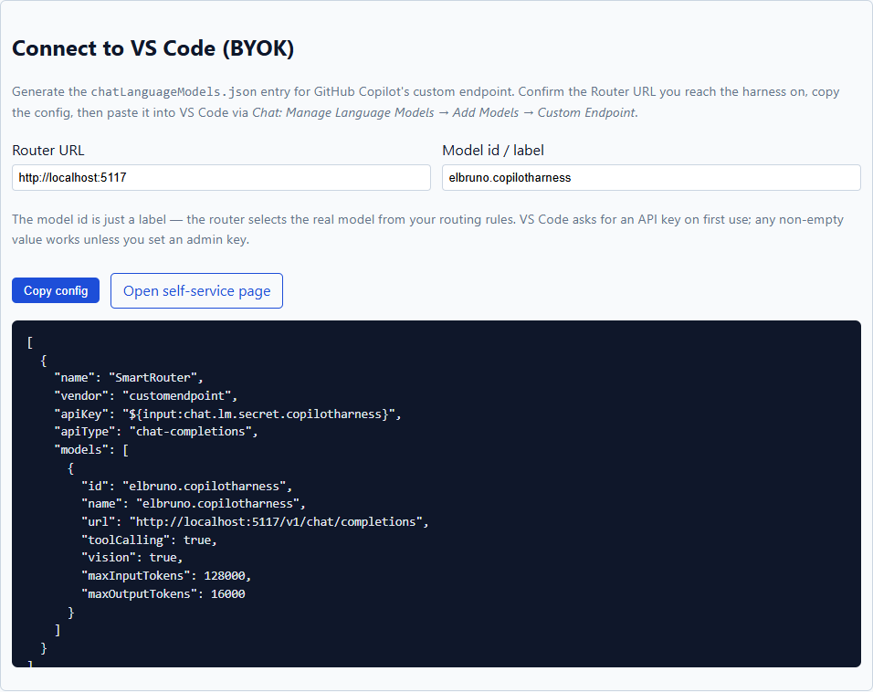

# Screenshots

Visual gallery of the ElBruno.CopilotHarness admin experience.

→ Back to [README](../README.md)

---

## Aspire Dashboard — all services healthy

---

## Admin — Routing Dashboard

---

## Admin — Live Routing (prompt → model → rule → explanation)

---

## Admin — Rules Editor

---

## Admin — Model Registry

---

## Judge — Benchmark Results

---

## Setup Wizard — Connect to VS Code (BYOK)

---

## VS Code — chatLanguageModels.json example

